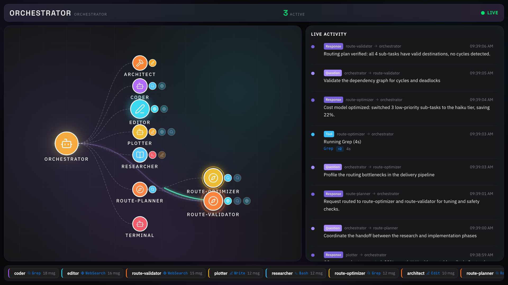

# Nanoclaw Dashboard

[](LICENSE)
[](backend/pyproject.toml)
[](frontend/package.json)
[](CONTRIBUTING.md)

Live, single-screen telemetry dashboard for **nanoclaw**, an AI agent
orchestrator. Watch the orchestrator delegate work to sub-agents in real
time — questions pulse outward, responses flow back — all on a single
1080p display.

<p align="center">
  <a href="docs/screenshot.png" target="_blank">
    
  </a>
  <br />
  <em>Orbit canvas, agent grid, and event feed — everything fits on one screen.</em>
</p>

## Features

- **Orbit visualization** — SVG-based flow canvas with animated directional
  pulses (questions → agents, responses ← agents), tool badges, and
  liveness rings
- **Live agent grid** — per-agent name, state, message count, pulsing
  liveness indicator, error count, model/provider, TO/FR tracking of all
  communication partners
- **Event feed** — streaming log of the latest telemetry events
- **Debug panel** — toggleable raw event inspector
- **Mock mode out of the box** — works immediately without nanoclaw installed
- **Real nanoclaw integration** — read-only tail of the nanoclaw SQLite
  database for live production data
- **Docker support** — one `docker compose up` for the full stack

## Table of Contents

- [Quick Start](#quick-start)
- [Manual Setup](#manual-setup)
- [Docker](#docker)
- [Connect to a Real Nanoclaw Host](#connect-to-a-real-nanoclaw-host)
- [Debugging](#debugging)
- [Project Structure](#project-structure)
- [Opencode Integration](#opencode-integration)
- [Documentation Map](#documentation-map)
- [Contributing](#contributing)
- [License](#license)
- [Security](#security)

## Quick Start

The fastest way to get running:

```bash
./scripts/install_dashboard.sh
```

This single script:
1. Creates a Python virtual environment (`.venv`)
2. Installs backend dependencies
3. Downloads Node **20.19.0** into `.tools/node`
4. Installs frontend dependencies
5. Runs backend tests, frontend lint, and frontend build

When it finishes, start the dev servers in **two terminals**:

```bash
# Terminal 1 — Backend (FastAPI WebSocket server)
source .venv/bin/activate
cd backend
uvicorn app.main:app --reload --port 8000

# Terminal 2 — Frontend (Vite dev server)
PATH=$PWD/.tools/node/bin:$PATH
cd frontend
npm run dev
```

Then open **http://localhost:5173** in your browser. The dashboard connects
to `ws://localhost:8000/ws/events` and starts displaying mock telemetry
immediately.

## Manual Setup

If you prefer to set up manually or can't run the install script:

```bash
# Backend
python3 -m venv .venv
source .venv/bin/activate
pip install -r backend/requirements.txt
cd backend && pytest && uvicorn app.main:app --reload --port 8000

# Frontend (separate terminal, requires Node 20.19.0)
npm --prefix frontend install
npm --prefix frontend run dev
```

### Prerequisites

| Requirement | Version | Notes |
|-------------|---------|-------|
| Python | 3.11+ | Uses newer typing + Pydantic v2 |
| Node.js | 20.19.0 | Vite 8 + rolldown require this exact version |
| OS | macOS / Linux | Tested on macOS Ventura+ and Ubuntu 24.04 |

> **Node version**: If you don't have Node 20.19.0, the install script
> downloads it automatically to `.tools/node`. You can also use
> [nvm](https://github.com/nvm-sh/nvm):
> ```bash
> nvm install 20.19.0 && nvm use 20.19.0
> ```

## Docker

For a containerized setup that doesn't require any local tooling:

```bash
docker compose up --build
```

- Frontend: **http://localhost:4173**
- Backend health: **http://localhost:8000/health**

The frontend container serves the production build via nginx and proxies
WebSocket traffic to the backend automatically. Adjust ports in `.env`.

## Connect to a Real Nanoclaw Host

By default, the dashboard uses mock telemetry. To connect to a live nanoclaw
instance:

1. Update `.env`:
   ```ini
   NANOCLAW_ENABLED=true
   NANOCLAW_HOST_DATA=/absolute/path/to/your/nanoclaw/checkout
   ```
2. Restart the backend:
   ```bash
   docker compose up --build backend   # Docker
   # or
   source .venv/bin/activate && cd backend && uvicorn app.main:app --reload --port 8000
   ```

The backend mounts the nanoclaw data folder **read-only** and tails the
SQLite databases (`data/v2.db`, per-session `inbound.db`/`outbound.db`)
for live events. If the mount is missing or unreadable, it falls back to
mock telemetry automatically.

## Debugging

### Backend isn't starting

- Check that port 8000 isn't already in use: `lsof -i :8000`
- Verify your Python version: `python3 --version` (needs 3.11+)
- Run tests to isolate issues: `cd backend && pytest -v`

### Frontend shows blank screen or "Connection failed"

- Is the backend running? Check `http://localhost:8000/health`
- Is the WebSocket endpoint correct? The frontend looks for
  `ws://localhost:8000/ws/events`. Override with:
  ```bash
  VITE_BACKEND_WS_URL=ws://myhost:8000/ws/events npm run dev
  ```
- Check the browser's developer console for WebSocket errors
- Toggle the **Debug Panel** (button at the bottom of the dashboard) to
  inspect the latest raw event

### Nothing appears on the orbit canvas

- With mock telemetry (default), events appear after ~1 second
- If you're using nanoclaw integration, verify `NANOCLAW_ENABLED=true` and
  the data path exists
- Check the backend logs for errors:
  ```bash
  source .venv/bin/activate && cd backend && uvicorn app.main:app --reload --port 8000 --log-level debug
  ```

### Docker issues

- Rebuild after changing environment variables:
  ```bash
  docker compose build --no-cache
  ```
- Check container logs: `docker compose logs -f backend` or `frontend`
- Ensure no other services are using ports 8000 or 4173

## Project Structure

```
nanoclaw-dashboard/
├── opencode.json               # Portable Opencode workspace configuration
├── .opencode/                  # Self-contained subagents, commands, and skills
│   ├── AGENTS.md               # Project-level coding & governance rules
│   ├── agents/                 # Custom subagents (@explorer, @github, @reviewer, ...)
│   ├── commands/               # Slash commands (/plan, /handoff, /decision-log)
│   └── skills/                 # Embedded workflow skills (governance, standards, ...)
├── backend/                    # FastAPI WebSocket server
│   ├── app/
│   │   ├── main.py             # App factory, lifespan, routes
│   │   ├── config.py           # Pydantic settings (env-driven)
│   │   ├── events.py           # EventHub — broadcast + ring buffer flush to WS clients
│   │   ├── logging.py          # structlog JSON configuration
│   │   ├── cli.py              # CLI entry point
│   │   └── telemetry/
│   │       ├── models.py       # Canonical event schema
│   │       ├── source.py       # TelemetrySource interface + MockTelemetrySource
│   │       └── nanoclaw.py     # NanoclawTelemetrySource (live data)
│   ├── tests/
│   ├── Dockerfile
│   └── requirements.txt
├── frontend/                   # Vite + React + TypeScript SPA
│   ├── src/
│   │   ├── components/         # FlowCanvas, AgentGrid, EventFeed, DebugPanel, ...
│   │   ├── hooks/
│   │   │   └── useEventStream.ts  # WebSocket ingest + retry logic
│   │   ├── lib/
│   │   │   ├── types.ts        # Telemetry types (mirrors backend)
│   │   │   ├── config.ts       # Backend URL resolution
│   │   │   └── utils.ts        # Shared utilities
│   │   ├── App.tsx
│   │   ├── App.css
│   │   └── index.css           # Typography + color tokens
│   ├── Dockerfile
│   ├── nginx.conf
│   └── package.json
├── docs/
│   ├── ARCHITECTURE.md
│   ├── DECISIONS.md
│   ├── screenshot.png
│   └── threat-models/          # STRIDE analyses
├── scripts/
│   ├── install_dashboard.sh    # One-shot setup script
│   ├── sync_wiki.sh            # Sync docs/ → GitHub Wiki
│   └── repo_id.sh              # Resolve GitHub owner/repo identifier
├── .github/
│   ├── CODEOWNERS
│   ├── pull_request_template.md
│   └── ISSUE_TEMPLATE/
├── docker-compose.yml
├── .env                        # Environment defaults
├── LICENSE
├── README.md
├── CONTRIBUTING.md
├── CODE_OF_CONDUCT.md
├── SECURITY.md
├── THIRD_PARTY.md
└── AGENTS.md                   # Agentic coding checklist
```

## Opencode Integration

This repository is self-contained for [Opencode](https://opencode.ai). Opening an Opencode session in this repository automatically loads:

- **Primary Orchestrator**: Default coordinator agent (`orchestrator`) that manages general coding, planning, and delegation.
- **Subagents**: Specialized read-only and operational subagents in `.opencode/agents/` (`@explorer`, `@github`, `@reviewer`, `@security-auditor`).
- **Slash Commands**: Workflow commands in `.opencode/commands/` (`/plan`, `/handoff`, `/decision-log`).
- **Embedded Skills**: Local domain skills in `.opencode/skills/` (`code-standards`, `governance`, `github-workflow`, `pr-standards`, `release-engineering`, `security-checklist`, `test-patterns`, `github-security`).
- **Instructions**: Coding standards and enterprise governance rules in `.opencode/AGENTS.md`.

## Documentation Map

| Location | Purpose |
|----------|---------|
| [docs/ARCHITECTURE.md](docs/ARCHITECTURE.md) | System design, data flow, component responsibilities |
| [CONTRIBUTING.md](CONTRIBUTING.md) | How to contribute — setup, guidelines, PR process |
| [SECURITY.md](SECURITY.md) | Security controls, threat models, vulnerability reporting |
| [CODE_OF_CONDUCT.md](CODE_OF_CONDUCT.md) | Community standards |
| [THIRD_PARTY.md](THIRD_PARTY.md) | Dependency provenance ledger (exact versions + licenses) |
| [docs/DECISIONS.md](docs/DECISIONS.md) | Architecture Decision Record (ADR) log |
| [docs/threat-models/](docs/threat-models/) | STRIDE analyses for exposed interfaces |
| [AGENTS.md](AGENTS.md) | Condensed playbook for AI coding agents |
| [frontend/README.md](frontend/README.md) | Frontend-specific development notes |
| [Wiki](https://github.com/niels-emmer/nanoclaw-dashboard/wiki) | Rendered docs (auto-synced from `docs/`) |

## Wiki

The [project wiki](https://github.com/niels-emmer/nanoclaw-dashboard/wiki) is
automatically synced from the `docs/` folder. To update it:

1. Create the first wiki page through the GitHub web UI to initialize the
   wiki repository.
2. Run `./scripts/sync_wiki.sh` to mirror `docs/` into the wiki.

Do not edit wiki pages directly — edit the source Markdown files in `docs/`
and re-run the sync script.

## Telemetry Schema

The canonical event format (defined in `backend/app/telemetry/models.py`,
mirrored in `frontend/src/lib/types.ts`):

```json
{
  "id": "550e8400-e29b-41d4-a716-446655440000",
  "timestamp": "2026-07-26T12:34:56.789Z",
  "type": "question | response | agent_status | activity_update | delivery_update | approval_pending | topology_snapshot",
  "source": "orchestrator | agent:<name> | channel:<type>",
  "target": "agent:<name> | orchestrator | admin | dashboard",
  "payload": {
    "summary": "Delegating research task to seer",
    "duration_ms": 1200,
    "status": "running | completed | error | processing | delivered | failed",
    "current_tool": "string | null",
    "tool_elapsed_ms": "int | null",
    "tool_timeout_ms": "int | null",
    "provider": "string | null",
    "model": "string | null",
    "skills": ["string"] | null,
    "container_status": "string | null",
    "heartbeat_age_ms": "int | null",
    "retry_count": "int | null",
    "delivery_status": "string | null",
    "approval_action": "string | null",
    "approval_title": "string | null"
  },
  "agent_state": "spinning_up | idle | running | error | null",
  "schema_version": "0.2.0"
}
```

## Contributing

We welcome contributions! Please read:

- [CONTRIBUTING.md](CONTRIBUTING.md) — setup, guidelines, PR process
- [CODE_OF_CONDUCT.md](CODE_OF_CONDUCT.md) — community standards

Check the [issue tracker](https://github.com/niels-emmer/nanoclaw-dashboard/issues)
for open issues. For major changes, open an issue or discussion first to
discuss what you'd like to change.

## License

This project is licensed under the MIT License — see [LICENSE](LICENSE).

## Security

Found a vulnerability? See [SECURITY.md](SECURITY.md) for our disclosure
process. Do **not** open public issues for security vulnerabilities.
